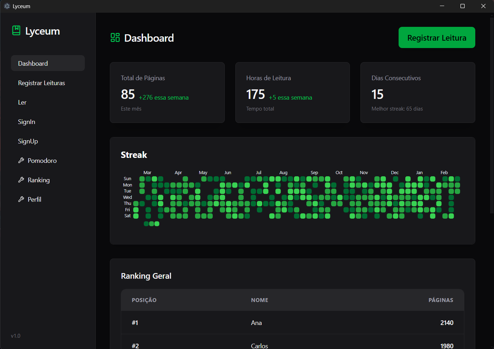
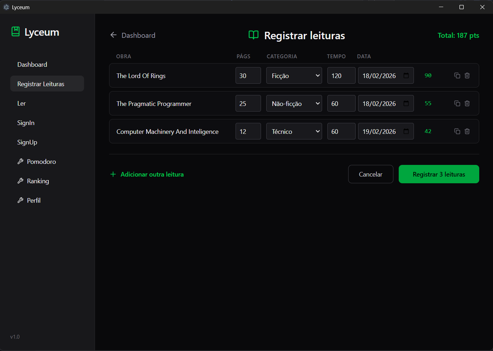
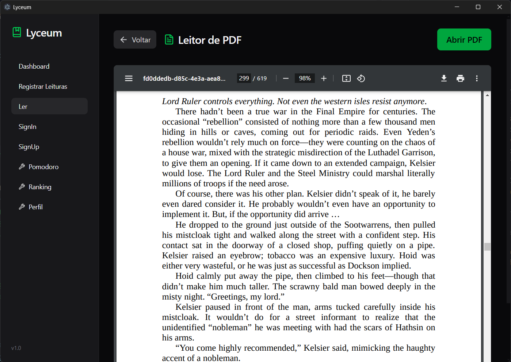
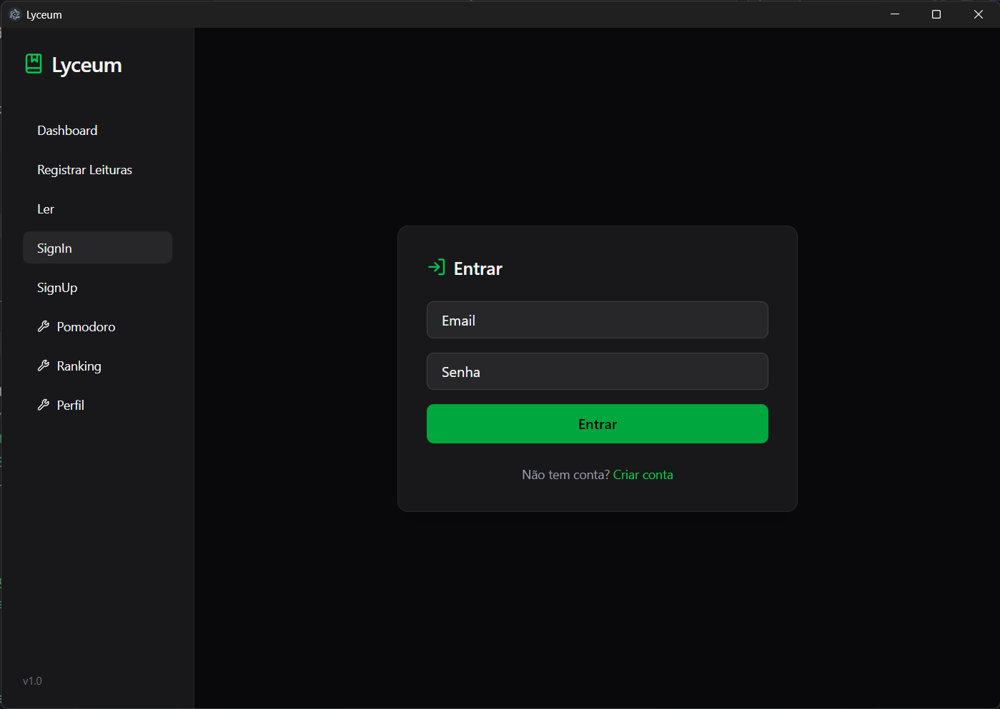
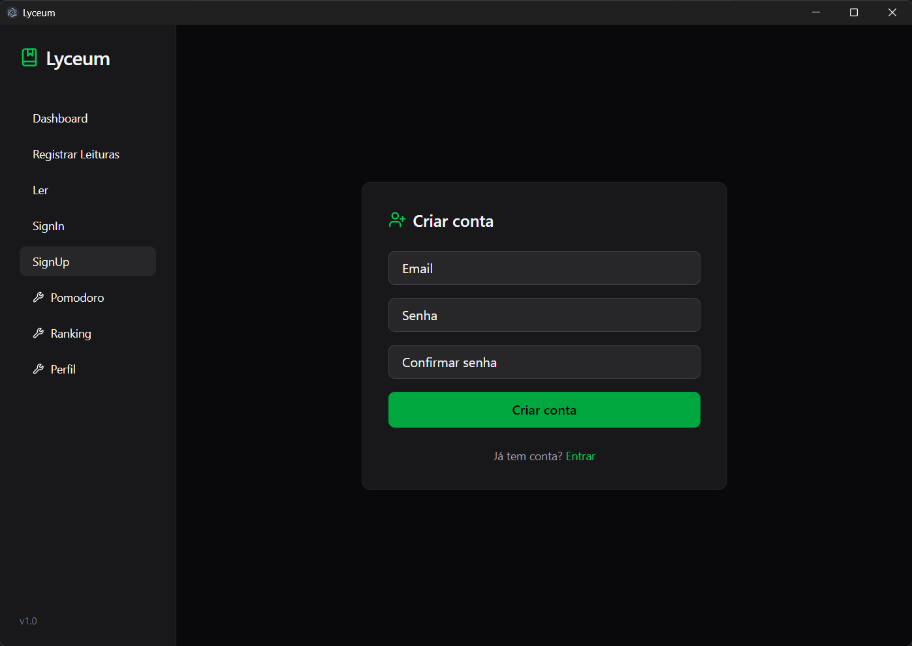

# Lyceum

[](https://www.typescriptlang.org/)
[](https://reactjs.org/)
[](https://www.electronjs.org/)
[](LICENSE)

**Lyceum** é uma aplicação desktop moderna para rastrear e analisar seus hábitos de leitura. Monitore suas páginas lidas, tempo dedicado à leitura, e compita com outros leitores em um ranking dinâmico.

## Telas da Aplicação

#### Dashboard

*Painel principal com estatísticas de leitura, heatmap de atividades e ranking geral*

**O que você vê:**
- Total de páginas lidas
- Horas dedicadas à leitura  
- Dias consecutivos de leitura
- Heatmap de atividades
- Ranking de leitores
- Histórico recente de leituras

#### Registrar Leitura

*Interface para adicionar novas leituras com detalhes do livro*

#### Leitor Integrado

*Leitor integrado para acompanhar leitura durante o uso da aplicação*

#### Autenticação
<!-- 
#### Sign In

*Página de login seguro com autenticação via Supabase* -->


*Registro de novos usuários na plataforma*

---

## Stack Tecnológico

### Frontend
- **React 18** - Framework UI
- **TypeScript** - Type safety
- **Tailwind CSS** - Styling
- **React Router** - Navegação

### Backend & Dados
- **Supabase** - Backend as a Service
- **PostgreSQL** - Banco de dados
- **Electron** - Desktop App

### Ferramentas
- **Vite** - Build tool rápido
- **Electron Builder** - Empacotamento da aplicação desktop
- **Lucide Icons** - Ícones vectorizados

## Como Iniciar

### Pré-requisitos
- Node.js 16+
- npm ou yarn

### Instalação

```bash
# Clonar repositório
git clone https://github.com/Higino-Neto/Lyceum.git
cd Lyceum

# Instalar dependências
npm install

# Configurar variáveis de ambiente
cp .env.example .env.local
# Adicione suas credenciais do Supabase em .env.local
```

### Desenvolvimento

```bash
# Iniciar modo desenvolvimento
npm run dev

# Compilar para produção
npm run build

# Empacotar para desktop
npm run electron-build
```

## Estrutura do Projeto

```
lyceum/
├── src/
│   ├── components/          # Componentes React reutilizáveis
│   │   ├── RankingTable.tsx
│   │   ├── ReadingHeatmap.tsx
│   │   ├── ReadingTable.tsx
│   │   ├── StatCard.tsx
│   │   └── Sidebar.tsx
│   ├── pages/               # Páginas da aplicação
│   │   ├── DashboardPage.tsx
│   │   ├── AddReadingPage.tsx
│   │   ├── RankingPage.tsx
│   │   ├── SignInPage.tsx
│   │   └── SignUpPage.tsx
│   ├── hooks/               # Custom React hooks
│   │   ├── useReadingStats.tsx
│   │   └── useGetReadings.tsx
│   ├── utils/               # Funções utilitárias
│   │   ├── auth.ts
│   │   ├── getUser.ts
│   │   └── getReadings.ts
│   ├── lib/                 # Configurações externas
│   │   └── supabase.ts
│   └── App.tsx
├── electron/                # Código Electron
│   ├── main.ts
│   └── preload.ts
├── public/                  # Assets estáticos
└── vite.config.ts           # Configuração Vite
```

### Schema do Banco de Dados

```yaml
profiles:
  - id (uuid, PK)
  - name (text)
  - level (numeric)
  - created_at (timestamp)

readings:
  - id (uuid, PK)
  - user_id (uuid, FK)
  - category_id (uuid, FK)
  - pages (int)
  - source_name (text)
  - reading_date (date)
  - created_at (timestamp)

categories:
  - id (uuid, PK)
  - name (text)
  - points_per_page (numeric)

reading_stats:
  - user_id (uuid, PK)
  - total_pages (int)
  - total_minutes (int)

user_streaks:
  - user_id (PK)
  - current_streak
  - longest_streak
  - last_completed_date
```

## Contribuindo

Contribuições são bem-vindas! Para contribuir:

1. Faça um Fork do projeto
2. Crie uma branch para sua feature (`git checkout -b feature/AmazingFeature`)
3. Commit suas mudanças (`git commit -m 'Add AmazingFeature'`)
4. Push para a branch (`git push origin feature/AmazingFeature`)
5. Abra um Pull Request

## Autor

**Higino Neto**
- GitHub: [@Higino-Neto](https://github.com/Higino-Neto)
