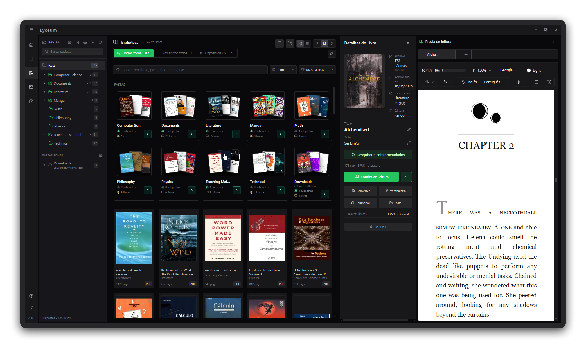

# Lyceum (Beta)

  

<h3 align="center">A smarter home for every book you read</h3>

  <a href="https://github.com/Higino-Neto/Lyceum/releases/latest">&nbsp</a>
  <a href="LICENSE">&nbsp</a>
  
  <a href="https://github.com/Higino-Neto/Lyceum/stargazers">&nbsp</a>

<picture>
  <source media="(prefers-color-scheme: dark)" srcset="public/images/lyceum-library-with-preview-v1.png">
  <source media="(prefers-color-scheme: light)" srcset="public/images/lyceum-library-with-preview-v1.png">
  
</picture>

## What is Lyceum?

Lyceum is a desktop app that manages your ebook library, reads PDF and EPUB files, tracks your progress, converts formats, and sends books to your portable E-Reader. It turns a loose folder of documents into a living reading workspace with covers, metadata, folders, notes, statistics, and local-first conversion tools.

It is built for readers who want one place to collect, read, understand, convert, and move their books without bouncing between a file manager, a reader, a stats spreadsheet, and a portable E-Reader transfer tool.

## Download

  <a href="https://github.com/Higino-Neto/Lyceum/releases/latest">&nbsp&nbsp&nbsp</a>
  <a href="https://github.com/Higino-Neto/Lyceum/releases/latest">&nbsp&nbsp&nbsp</a>
  <a href="https://github.com/Higino-Neto/Lyceum/releases/latest">&nbsp&nbsp&nbsp</a>

<video autoplay muted loop playsinline width="100%" poster="https://raw.githubusercontent.com/Higino-Neto/Lyceum/main/public/images/lyceum-library-with-preview-v1.png">
  <source src="https://raw.githubusercontent.com/Higino-Neto/Lyceum/main/public/images/lyceum-flow-v1.mp4" type="video/mp4">
</video>

## Your Library, Evolved

Your library is the center of Lyceum. Import PDFs, EPUBs, CBZ files, TXT documents, and HTML books, then keep them organized with real folders, collections, covers, and rich metadata.

<picture>
  <source media="(prefers-color-scheme: dark)" srcset="public/library-v1.png">
  <source media="(prefers-color-scheme: light)" srcset="public/library-v1.png">
  
</picture>

- Browse books as a cover grid with visible thumbnails and metadata.
- Create, rename, move, and delete real folders inside the managed library.
- Edit title, author, series, publisher, ISBN, language, description, notes, and cover data.
- Search across your library and filter by format, date, and sync status.
- Detect documents that live outside the managed library and move or copy them in when you are ready.
- Source folder your already defined library in disc.

> [Image: library list view with sortable rows, file format chips, progress, rating, sync state, and quick actions]
> [Image: folder tree with drag-and-drop reordering, nested folders, and a context menu]
> [Image: book metadata editor showing title, author, series, publisher, ISBN, language, description, tags, cover, notes, favorite, and rating]

## Smart Reader

Open multiple books at once, switch between them like browser tabs, and come back exactly where you stopped.

- Read PDF and EPUB files inside the app, without losing the library context.
- Keep multiple documents open in persistent tabs.
- Restore page, zoom, scroll, chapter position, and reader state after restart.
- Use focus-friendly reading surfaces for long sessions.
- Navigate EPUB chapters and table-of-contents entries directly.

> [Image: reader with a PDF tab and an EPUB tab open side by side in the tab bar]
> [Image: EPUB reader with table of contents open, current chapter highlighted, and reading position restored]

## Know Your Reading

Lyceum turns reading into visible momentum. Reading sessions become dashboards, streaks, charts, and rankings that make your progress easier to understand.

- See GitHub-style heatmaps for reading consistency.
- Track current streaks, pages read, time spent, books finished, and weekly pace.
- Review charts for pages per day, time per week, and books per month.
- Sync account-level reading statistics with Supabase when configured.
- Compare rankings when cloud reading data is enabled.

> [Image: dashboard heatmap with streak counter, weekly reading cards, and a calm dark interface]
> [Image: statistics charts showing pages per day, reading time by week, and books completed by month]

## Break Free from Formats

Lyceum helps your books move where you need them. Convert locally between common reading formats without installing Calibre, Pandoc, ebook-convert, or kindlegen.

- Import EPUB, PDF, CBZ, TXT, HTML, AZW3, and KFX into the library.
- Convert all formats to all formats with Lyceum's local pipeline.
- Generate KFX when Kindle Previewer is configured for that optional route.
- Keep files on your machine during conversion.
- Review conversion results and warnings instead of guessing what happened.

> [Image: conversion dialog with a selected source book and output choices for EPUB, PDF, AZW3, and KFX]
> [Image: conversion report showing output path, format, warnings, metadata, and validation status]

## Send to Kindle

Connect a Kindle, choose books from the library, and let Lyceum prepare the right files for sideloading.

- Detect Kindle devices through USB storage or Windows MTP.
- Convert EPUB, PDF, TXT, HTML, and CBZ to KFX, AZW3, or MOBI before transfer when needed.
- Organize output filenames by title and author.
- Avoid unsupported direct transfers by guiding books through the conversion path.
- This feature works better with latest versions of kindle.

> [Image: Kindle send panel showing a detected Paperwhite, a selected book queue, AZW3 conversion enabled, and transfer status]
> [GIF: sending three books to Kindle, with one already in AZW3 and two converted before transfer]

## Built-in Dictionary

Stay in the flow when a word interrupts you. Lyceum can look up words inside the reader, use local dictionary packages, and help you build vocabulary from the books you already own.

- Select a word in an EPUB and open definitions without leaving the reader.
- Use downloaded bilingual dictionary packages for offline lookup.
- Extract vocabulary signals from EPUB text for deeper study.

> [Image: dictionary lookup panel inside the EPUB reader showing original word, phonetic hint, definitions, and translated meanings]
> [Image: vocabulary view showing frequent words extracted from an EPUB and dictionary package controls]

## Under the Hood

Lyceum uses a practical desktop stack: Electron for native APIs, React and TypeScript for the interface, Tailwind for styling, SQLite for local library state, Supabase for optional cloud reading data, PDF.js and EPUB tooling for readers, sharp for thumbnails and image processing, and Vitest for tests.

## Documentation

The full documentation lives in [docs](docs/index.md), including architecture, local data, sync behavior, development, and releases.

## License

MIT. See [LICENSE](LICENSE).

## Author

Higino Neto - [@Higino-Neto](https://github.com/Higino-Neto)
