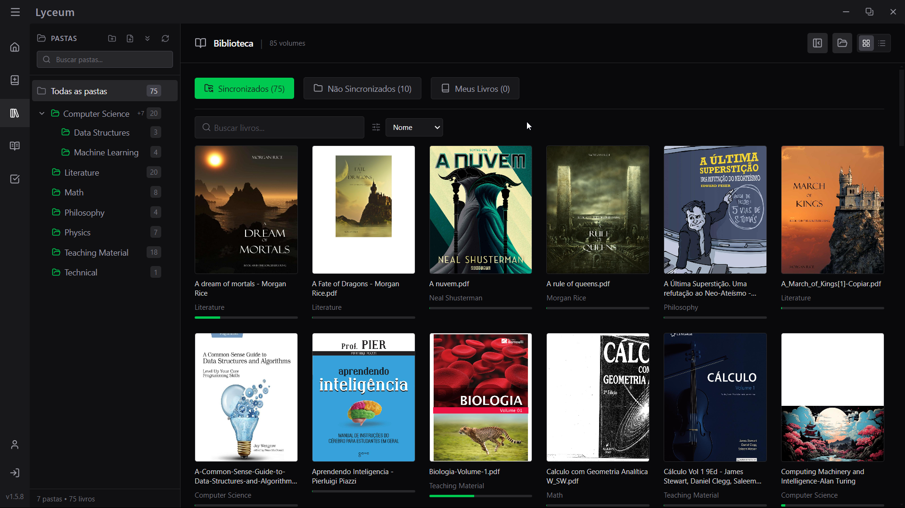
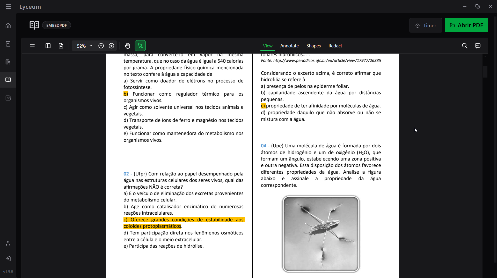
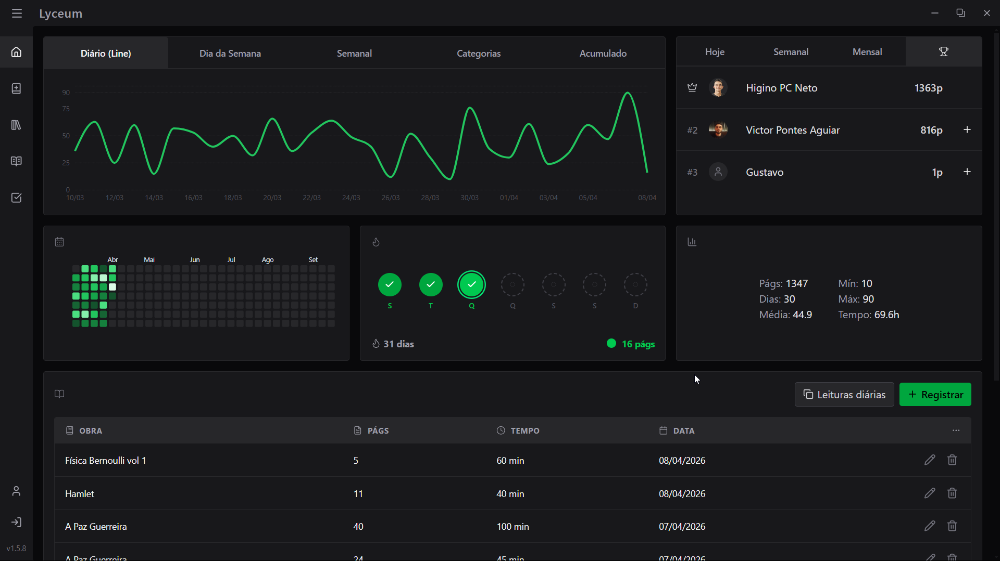
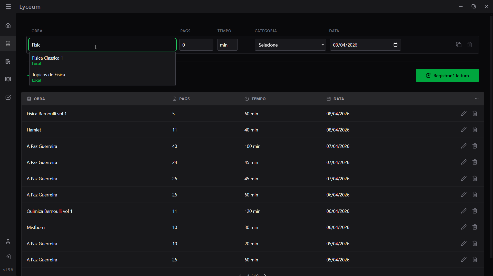

# Lyceum

Lyceum is a desktop reading companion for PDF and EPUB books. It combines a local library, an embedded reader, reading sessions, dashboards, habits, and cloud-backed reading statistics in one Electron application.

The project is built for readers who want more than a file viewer: Lyceum keeps documents organized, remembers reader state, tracks reading effort, and turns a local collection into measurable progress.



## What Lyceum Does

- Opens PDF and EPUB files in an integrated reader with persistent tabs.
- Saves reading state locally, including page, zoom, scroll, and annotations state.
- Manages a local library folder with folders, thumbnails, metadata, favorites, ratings, notes, and search.
- Detects unsynchronized documents and can move or copy them into the managed library.
- Tracks reading sessions and sends reading history to Supabase.
- Shows dashboards with pages read, reading time, streaks, heatmaps, charts, and rankings.
- Supports user accounts through Supabase Auth.
- Packages as a desktop app through Electron Builder and publishes releases through GitHub Releases.

## Screenshots

### Reader



### Dashboard



### Add Reading



### Authentication


## Documentation

The full project documentation lives in [`docs/`](docs/index.md). It covers the product, local architecture, reader, library, database model, development workflow, and release process.

Start here:

- [Project Documentation](docs/index.md)
- [Architecture](docs/architecture.md)
- [Library and Reader](docs/library-reader.md)
- [Data and Sync](docs/data-and-sync.md)
- [Development Guide](docs/development.md)
- [Release Guide](docs/release.md)

The repository also includes a GitHub Pages workflow at [`.github/workflows/docs.yml`](.github/workflows/docs.yml). After GitHub Pages is enabled for Actions in the repository settings, documentation changes pushed to `main` are published automatically.

## Tech Stack

- React 18, TypeScript, Vite, and Tailwind CSS for the renderer.
- Electron for the desktop shell, native file dialogs, file watching, IPC, and packaging.
- SQLite through `better-sqlite3` for local document state.
- Supabase Auth and PostgreSQL for user accounts, reading entries, stats, books, and rankings.
- `@embedpdf/react-pdf-viewer`, `pdf-lib`, `pdf-poppler`, and `epubjs` for document reading and processing.
- TanStack Query for remote data caching.
- Vitest and Testing Library for tests.

## Getting Started

Requirements:

- Node.js 20+
- npm
- A Supabase project if you want authentication and cloud stats

Install dependencies:

```bash
npm install
```

Create a local environment file:

```bash
cp .env.example .env
```

Configure Supabase:

```env
VITE_SUPABASE_URL=your_supabase_url
VITE_SUPABASE_ANON_KEY=your_supabase_anon_key
```

Run the app in development:

```bash
npm run dev
```

Build the renderer and Electron main process:

```bash
npm run build
```

Create desktop packages:

```bash
npm run dist
```

## Scripts

| Command | Purpose |
| --- | --- |
| `npm run dev` | Starts Vite and Electron in development mode. |
| `npm run build` | Type-checks and builds the app. |
| `npm run dist` | Builds distributable desktop packages. |
| `npm run lint` | Runs ESLint. |
| `npm run test` | Runs Vitest in watch mode. |
| `npm run test:run` | Runs the test suite once. |

## Project Structure

```text
.
├── electron/              # Electron main process, preload, SQLite, backup, dictionary services
├── src/                   # React renderer
│   ├── api/               # Supabase API helpers
│   ├── components/        # Shared UI components
│   ├── contexts/          # React contexts, including document tabs
│   ├── hooks/             # Shared hooks
│   ├── pages/             # App screens
│   │   ├── DashboardPage/
│   │   ├── Library/
│   │   ├── ReadingPage/
│   │   └── HabitTrackerPage/
│   ├── test/              # Vitest and Testing Library tests
│   ├── types/             # Shared TypeScript types
│   └── utils/             # Utility functions
├── public/                # Static assets and screenshots
├── scripts/               # Utility scripts
├── docs/                  # GitHub Pages documentation
└── .github/workflows/     # Release and documentation workflows
```

## Data Model

Lyceum uses two persistence layers:

- Local SQLite stores document metadata, file paths, reader state, thumbnails, categories, local habits, and offline-friendly library data.
- Supabase stores authenticated user data, reading entries, books, reading statistics, categories, and ranking-related data.

See [Data and Sync](docs/data-and-sync.md) for the full model and data flow.

## Contributing

1. Create a branch from `main`.
2. Install dependencies with `npm install`.
3. Make the change with focused tests when behavior changes.
4. Run `npm run build` and the relevant tests.
5. Open a pull request with the user-facing behavior and verification notes.

## License

MIT. See [LICENSE](LICENSE).

## Author

Higino Neto - [@Higino-Neto](https://github.com/Higino-Neto)
