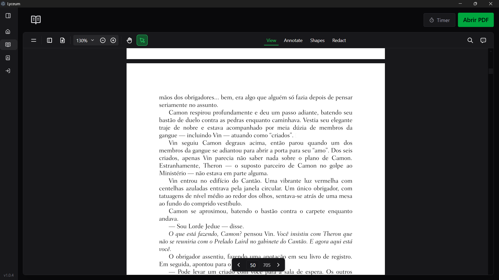
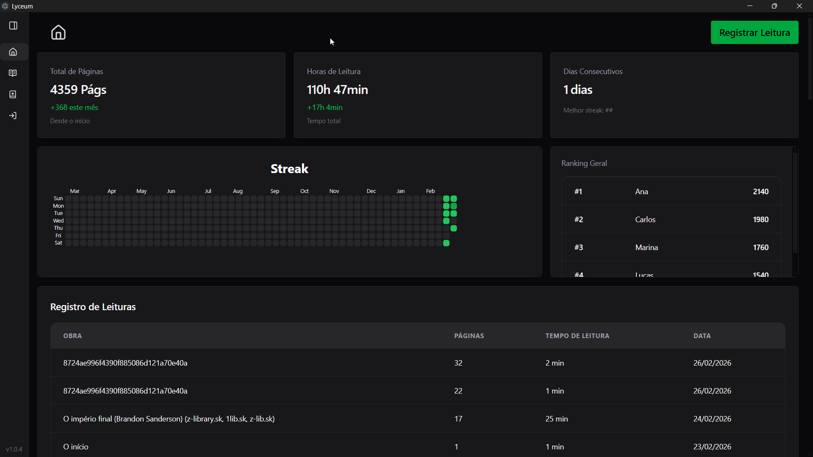
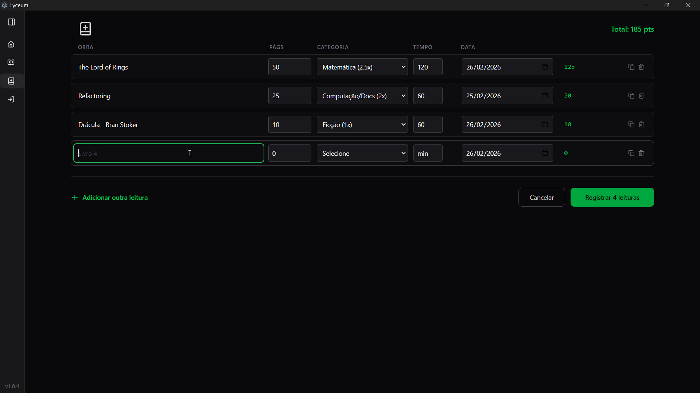
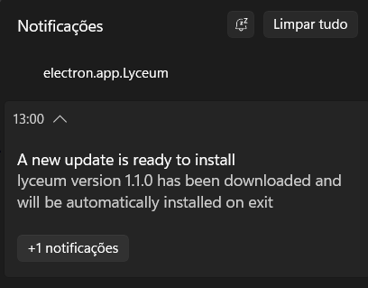
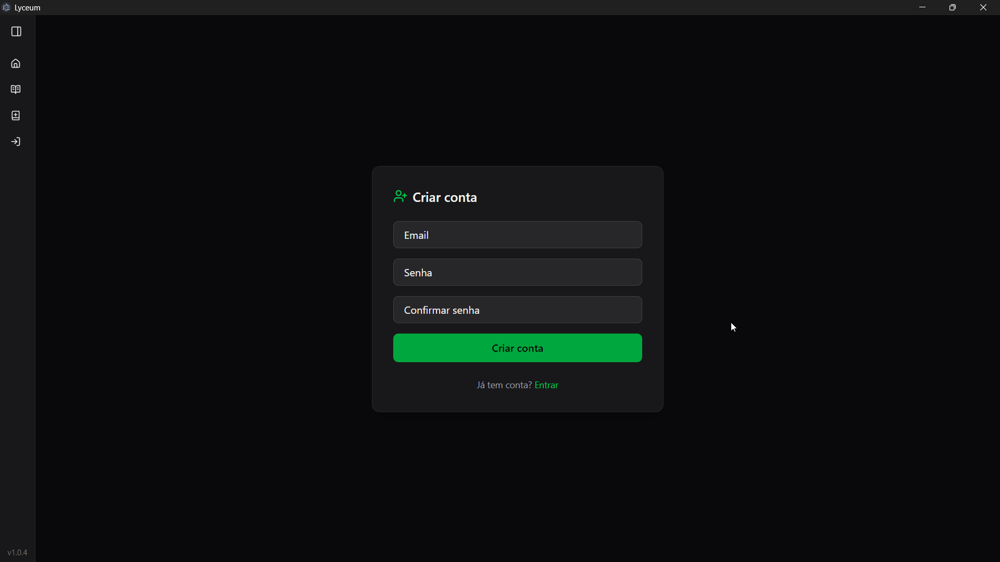

# Lyceum

[](https://www.typescriptlang.org/)
[](https://reactjs.org/)
[](https://www.electronjs.org/)
[](LICENSE)

**Lyceum** é um leitor de PDF desktop focado em rastrear e analisar sua vida literária. Monitore suas páginas lidas, sua velocidade média, seu tempo dedicado à leitura, e compita com outros leitores com um sistema de pontos com pesos para diferentes dificuldades.

---

## Demonstrações

### Leitor Integrado

_Leitor integrado com persistência automática de progresso (página, zoom, scroll)_

### Biblioteca
<video src="public/library 2x 720p.mp4" controls width="100%"></video>
_Organização por categorias, thumbnails automáticos, filtros e busca_

### Dashboard

_Estatísticas, heatmap de atividades e ranking geral_

### Registrar Leitura

_Registro de sessões com categoria e tempo_

### Auto Update

_Atualizações automáticas via GitHub Releases_

### Autenticação

_Cadastro e login com Supabase Auth_

---

## Funcionalidades

### Leitor de PDF Integrado
- Leitura direta na aplicação com suporte a PDFs
- **Persistência de progresso**: página atual, zoom e scroll são salvos automaticamente
- Geração automática de thumbnails para cada documento
- Contador de tempo de sessão de leitura

### Biblioteca Local
- Organização de documentos por categorias (pastas)
- Visualização em grid ou lista com thumbnails
- Busca, ordenação (nome, progresso, páginas) e filtros (todos, em leitura, concluídos)
- Sistema de sincronização: arquivos não sincronizados podem ser movidos ou copiados para a library local
- Escaneamento automático de PDFs na pasta `library` do usuário

### Dashboard e Estatísticas
- Total de páginas lidas (geral e mensal)
- Tempo total dedicado à leitura (geral e mensal)
- Dias consecutivos de leitura (streak atual)
- Heatmap de atividades de leitura
- Histórico recente de leituras
- Ranking de leitores com sistema de pontos por categoria

### Sistema de Pontos
Pontuação por página varía conforme a categoria do livro:
- **Ficção**: 1 ponto/página
- **Matemática**: 2 pontos/página
- **Ciências**: 1.5 pontos/página
- **Filosofia**: 2 pontos/página
- **Computação/Docs**: 1 ponto/página
- **Idiomas**: 1.5 pontos/página

### Autenticação e Nuvem
- Cadastro e login via Supabase Auth
- Dados sincronizados na nuvem (PostgreSQL)
- Preservação de ranking entre usuários

### Atualizações Automáticas
- Auto-update via GitHub Releases usando electron-updater
- Instalação automática de novas versões

---

## Stack

### Frontend
- **React 18** - Framework UI
- **TypeScript** - Type safety
- **Tailwind CSS** - Styling
- **React Router** - Navegação
- **@uiw/react-heat-map** - Heatmap de atividades

### Backend & Dados
- **Supabase** - Backend as a Service (Auth + PostgreSQL)
- **Electron** - Desktop App wrapper
- **better-sqlite3** - Banco de dados local para persistência de documentos

### Leitura de PDF
- **pdf-lib** - Manipulação de PDF (contagem de páginas)
- **@embedpdf/react-pdf-viewer** - Componente de visualização
- **pdf-poppler** - Geração de thumbnails

### Desktop
- **Electron Builder** - Empacotamento da aplicação
- **electron-updater** - Atualizações automáticas
- **Vite + vite-plugin-electron** - Build tool com suporte Electron

### Ícones
- **Lucide React** - Ícones vetorizados

---

## Decisões de Arquitetura

### Persistência Híbrida
O projeto utiliza uma estratégia de persistência em duas camadas:

1. **Local (SQLite)**: Armazena metadados dos PDFs, progresso de leitura, thumbnails e estado do leitor. Isso permite acesso offline e inicialização rápida.

2. **Nuvem (Supabase/PostgreSQL)**: Armazena dados do usuário (leituras registradas, estatísticas, ranking). Permite sincronização entre dispositivos e competição entre usuários.

### Estrutura de Categorias
As categorias são derivadas da estrutura de pastas na pasta `library`. Arquivos em subpastas tornam-se categorizados automaticamente (ex: `library/Computação/book.pdf` → categoria "Computação").

### Sistema de Sessão de Leitura
O timer de sessão rastreia:
- Páginas lidas na sessão
- Tempo gasto
- Categoria do livro

Esses dados são usados para calcular estatísticas e pontuação no ranking.

---

## Como Usar

### Download Rápido
[](https://github.com/Higino-Neto/Lyceum/releases/latest)

Baixe e instale a versão mais recente diretamente das [Releases do GitHub](https://github.com/Higino-Neto/Lyceum/releases/latest).

---

### Desenvolvimento (Build Local)

Se você deseja contribuir ou rodar o código-fonte:

```bash
# Clonar repositório
git clone https://github.com/Higino-Neto/Lyceum.git
cd Lyceum

# Instalar dependências
npm install

# Configurar variáveis de ambiente
cp .env.example .env.local
# Adicione suas credenciais do Supabase em .env.local

# Iniciar modo desenvolvimento
npm run dev

# Compilar para produção
npm run build

# Empacotar para desktop
npm run dist
```

---

## Variáveis de Ambiente

Crie um arquivo `.env.local` com:

```env
VITE_SUPABASE_URL=seu_supabase_url
VITE_SUPABASE_ANON_KEY=sua_chave_anonima
```

---

## Estrutura do Projeto

```
lyceum/
├── src/
│   ├── components/              # Componentes React reutilizáveis
│   │   ├── RankingTable.tsx
│   │   ├── ReadingHeatmap.tsx
│   │   ├── ReadingTable.tsx
│   │   ├── StatCard.tsx
│   │   ├── Sidebar.tsx
│   │   └── ProtectedRoute.tsx
│   ├── pages/                   # Páginas da aplicação
│   │   ├── DashboardPage/       # Dashboard com estatísticas
│   │   ├── Library.tsx         # Biblioteca de documentos
│   │   ├── ReadingPage/        # Leitor de PDF
│   │   ├── AddReadingPage.tsx  # Registro de leitura
│   │   ├── RankingPage.tsx     # Ranking de usuários
│   │   ├── SignInPage.tsx      # Login
│   │   └── SignUpPage.tsx      # Cadastro
│   ├── hooks/                   # Custom React hooks
│   │   ├── useReadingStats.tsx
│   │   └── useGetReadings.tsx
│   ├── utils/                   # Funções utilitárias
│   ├── lib/                     # Configurações externas
│   │   └── supabase.ts
│   └── types/                   # TypeScript types
├── electron/                    # Código Electron
│   ├── main.ts                  # Processo principal
│   ├── preload.ts               # Preload script
│   └── local-database.ts       # SQLite local
├── public/                       # Assets estáticos
└── vite.config.ts               # Configuração Vite
```

### Schema do Banco de Dados

**Tabela: profiles**
| Coluna | Tipo | Descrição |
|--------|------|-----------|
| id | uuid | PK |
| name | text | Nome do usuário |
| level | numeric | Nível calculado |
| created_at | timestamp | Data de criação |

**Tabela: readings**
| Coluna | Tipo | Descrição |
|--------|------|-----------|
| id | uuid | PK |
| user_id | uuid | FK → profiles |
| category_id | uuid | FK → categories |
| pages | int | Páginas lidas |
| source_name | text | Nome do livro/fonte |
| reading_date | date | Data da leitura |
| created_at | timestamp | Registro |

**Tabela: categories**
| Coluna | Tipo | Descrição |
|--------|------|-----------|
| id | uuid | PK |
| name | text | Nome da categoria |
| points_per_page | numeric | Pontos por página |

**Tabela: reading_stats**
| Coluna | Tipo | Descrição |
|--------|------|-----------|
| user_id | uuid | PK |
| total_pages | int | Total de páginas |
| total_minutes | int | Total de minutos |

**Tabela: user_streaks**
| Coluna | Tipo | Descrição |
|--------|------|-----------|
| user_id | uuid | PK |
| current_streak | int | Streak atual |
| longest_streak | int | Maior streak |
| last_completed_date | date | Última leitura |

---

## Contribuindo

Contribuições são bem-vindas! Para contribuir:

1. Faça um Fork do projeto
2. Crie uma branch para sua feature (`git checkout -b feature/AmazingFeature`)
3. Commit suas mudanças (`git commit -m 'Add AmazingFeature'`)
4. Push para a branch (`git push origin feature/AmazingFeature`)
5. Abra um Pull Request

---

## Autor

**Higino Neto**

- GitHub: [@Higino-Neto](https://github.com/Higino-Neto)
