# Lyceum (Beta)

  

<h3 align="center">A smarter home for every book you read</h3>

  <a href="https://github.com/Higino-Neto/Lyceum/releases/latest">&nbsp</a>
  <a href="LICENSE">&nbsp</a>
  
  <a href="https://github.com/Higino-Neto/Lyceum/stargazers">&nbsp</a>

<picture>
  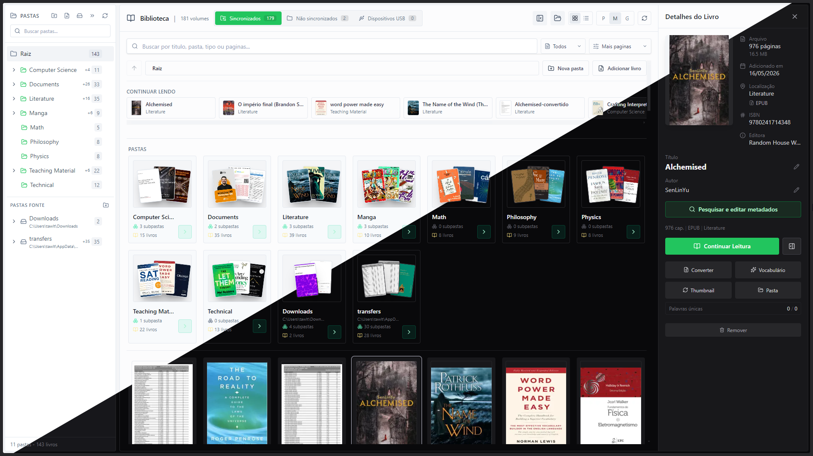
</picture>

---

## What is Lyceum?

Lyceum is a desktop app that manages your ebook library, reads your books in almost any format, tracks your progress, converts formats, and sends books to your portable E-Reader. It turns a loose folder of documents into a living reading workspace with covers, metadata, folders, collections, notes, statistics, and offline conversion tools.

It is built for readers who want one place to collect, read, understand, convert, and move their books without bouncing between a file manager, a conversion app, a reader, and a portable E-Reader transfer tool.

---
## Download

  <a href="https://github.com/Higino-Neto/Lyceum/releases/latest">&nbsp&nbsp&nbsp</a>
  <a href="https://github.com/Higino-Neto/Lyceum/releases/latest">&nbsp&nbsp&nbsp</a>
  <a href="https://github.com/Higino-Neto/Lyceum/releases/latest">&nbsp&nbsp&nbsp</a>

---
## Your Library, Evolved

Your library is the center of Lyceum. Import PDFs, EPUBs, CBZ files, TXT documents, HTML books, and so on, then keep them organized with real folders, collections, covers, and rich metadata.

<picture>
  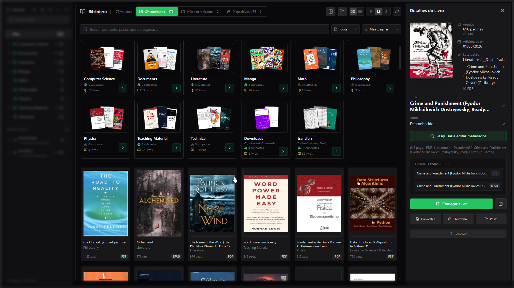
</picture>

- Search across your library and filter by format, date, and sync status.
- Detect documents that live outside the managed library and move or copy them in when you are ready.
- Browse books as a cover grid with visible thumbnails and metadata.

<picture>
  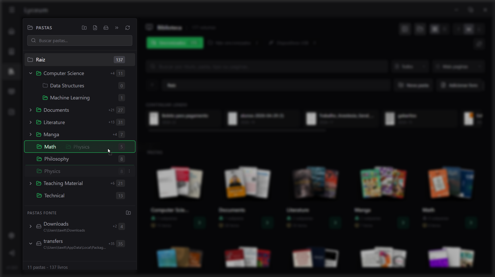
</picture>

- Create, rename, move, and delete folders directly inside the library.
- Link existing directories from anywhere on your disk. Lyceum watches them without duplicating files, so your original folder structure stays untouched.
- Move books between folders by dragging. Works with nested folders and subfolder trees.

<picture>
  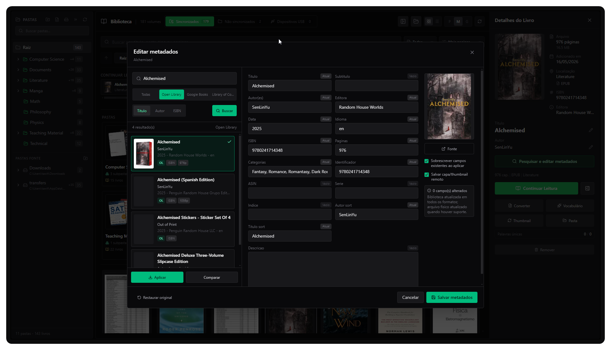
</picture>

- Edit title, author, series, publisher, ISBN, language, description, notes, and cover data.

---
## Smart Reader

Open multiple books at once, switch between them like browser tabs, and come back exactly where you stopped.

<picture>
  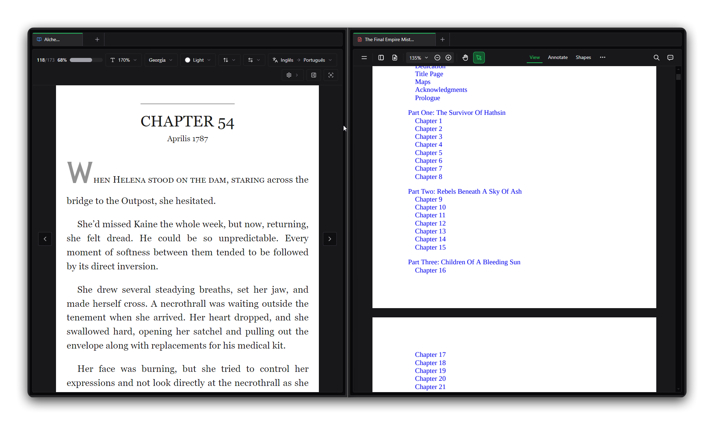
</picture>

- Read PDF and EPUB files inside the app, without losing the library context.

<picture>
  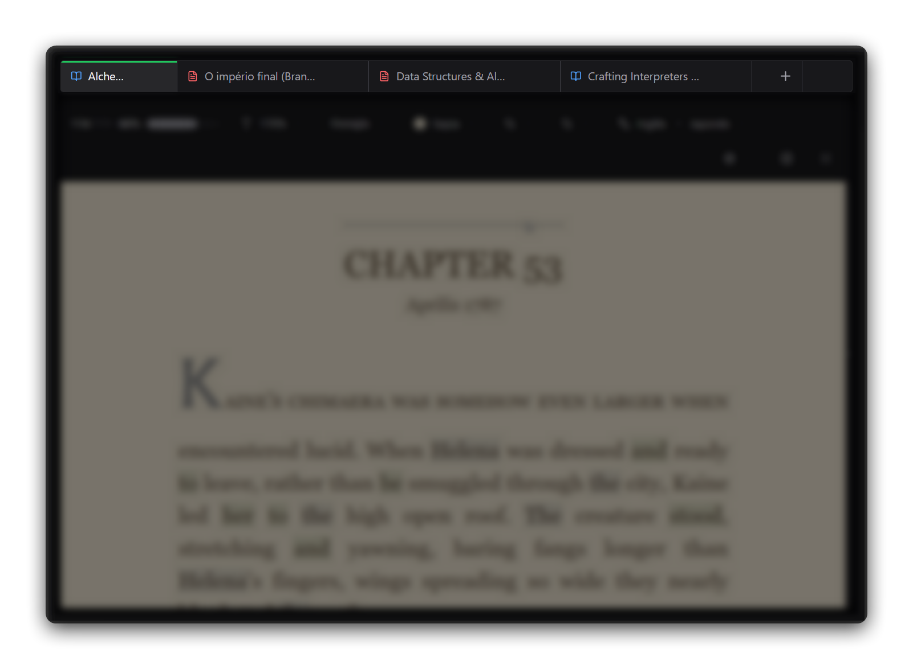
</picture>

- Keep multiple documents open in persistent tabs.
- Restore page, zoom, scroll, chapter position, and reader state after restart.

---
## Know Your Reading

Lyceum turns reading into visible momentum. Reading sessions become dashboards, streaks, charts, and rankings that make your progress easier to understand.

<picture>
  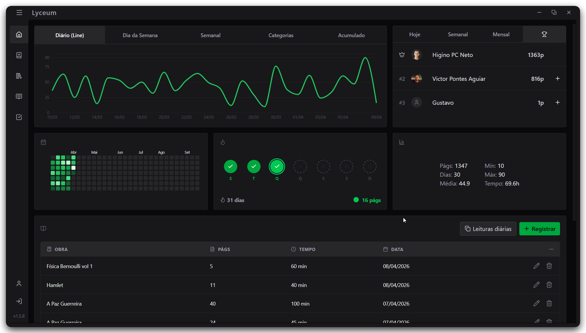
</picture>
<picture>
  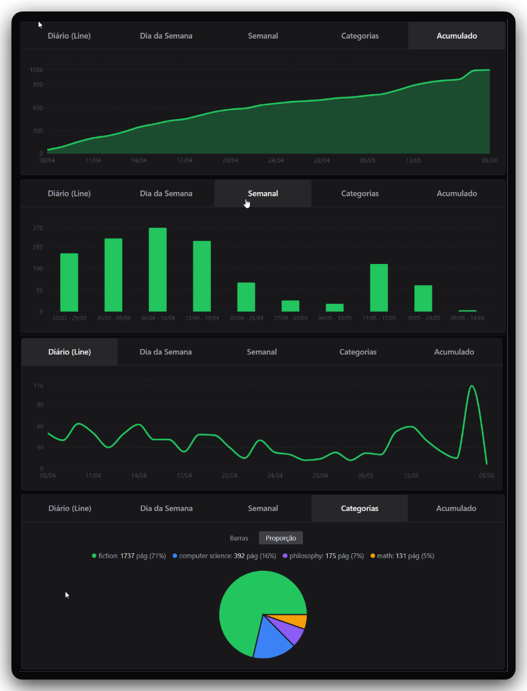
</picture>

- See GitHub-style heatmaps for reading consistency.
- Track current streaks, pages read, time spent, books finished, and weekly pace.
- Review charts for pages per day, time per week, and books per month.

---
## Break Free from Formats

Lyceum helps your books move where you need them. Convert locally between common reading formats without installing Calibre, Kindle Comic Converter, Adobe Acrobat Pro, Pandoc, ebook-convert, or kindlegen.

<picture>
  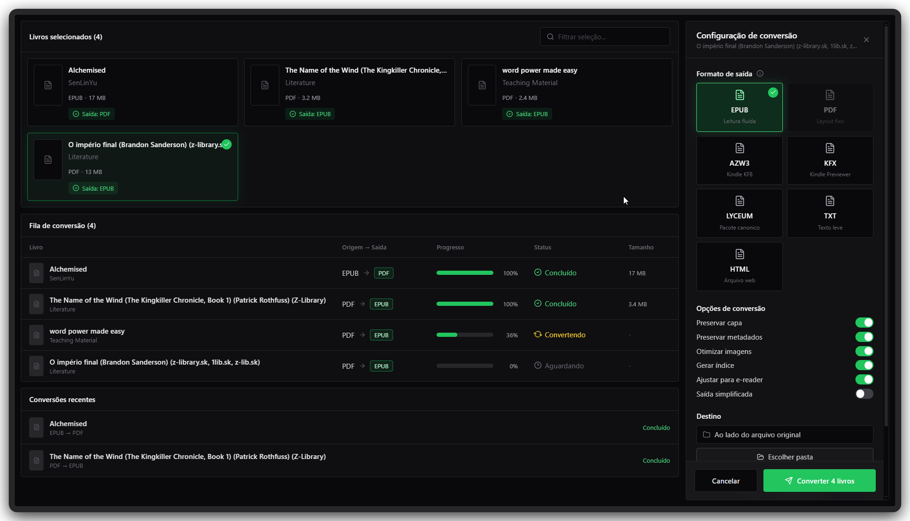
</picture>

- Import EPUB, PDF, CBZ, TXT, HTML, AZW3, and KFX into the library.
- Convert all formats to all formats with Lyceum's local pipeline.
- Generate KFX when Kindle Previewer is configured for that optional route.
- Review conversion results and warnings instead of guessing what happened.

---
## Send to Kindle

Connect a Kindle, choose books from the library, and let Lyceum prepare the right files for sideloading.

<picture>
  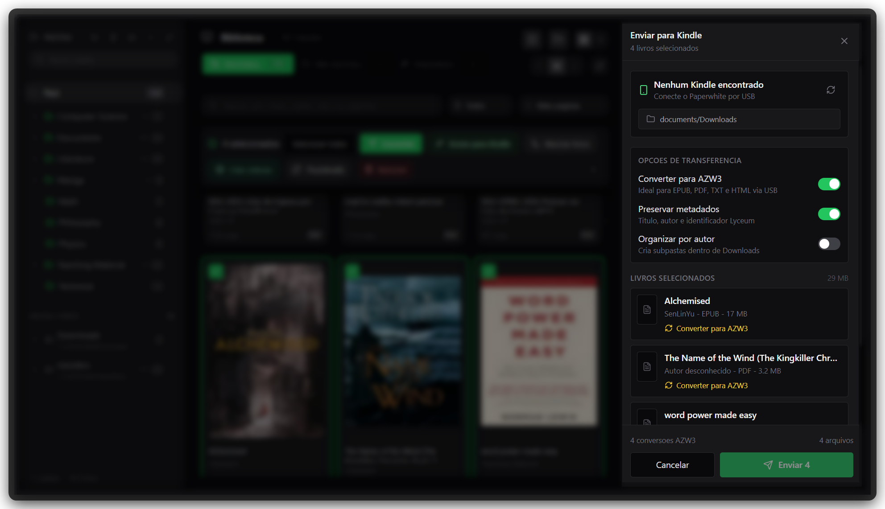
</picture>

- Detect Kindle devices through USB storage or Windows MTP.
- Convert EPUB, PDF, TXT, HTML, and CBZ to KFX, AZW3, or MOBI before transfer when needed.
- Organize output filenames by title and author.
- Avoid unsupported direct transfers by guiding books through the conversion path.
- This feature works better with the latest versions of Kindle. (But further versions certainly will add support for older versions and other e-readers, like Kobo and Onyx Boox.)

---
## Built-in Dictionary

Stay in the flow when a word interrupts you. Lyceum can look up words inside the reader, use local dictionary packages, and help you build vocabulary from the books you already own.

<picture>
  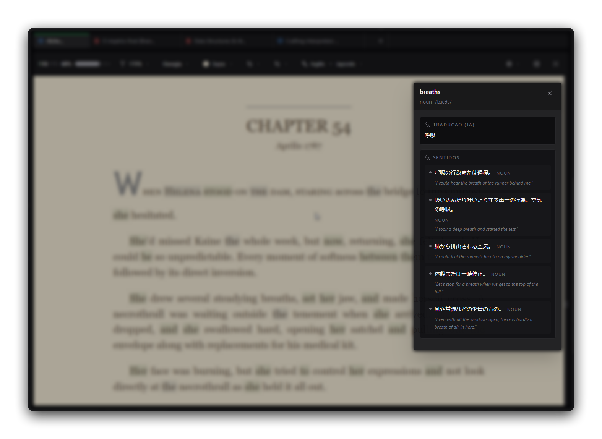
</picture>

- Select a word in an EPUB and open definitions without leaving the reader.
- Use downloaded bilingual dictionary packages for offline lookup.
- Extract vocabulary signals from EPUB text for deeper study.

---
## Under the Hood

Lyceum uses a simple desktop stack: Electron for native APIs, React and TypeScript for the interface, Tailwind for styling, SQLite for local library state, Supabase for optional cloud reading data, PDF.js and EPUB tooling for readers, sharp for thumbnails and image processing, and Vitest for tests.
(Suggestions of new features are welcome!)

---
## Documentation

The full documentation lives in [docs](docs/index.md), including architecture, local data, sync behavior, development, and releases.

---
## License

MIT. See [LICENSE](LICENSE).

---
## Author

Higino Neto - [@Higino-Neto](https://github.com/Higino-Neto)
